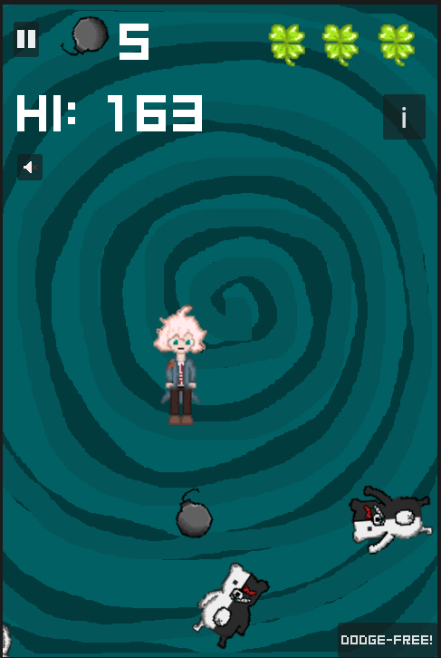
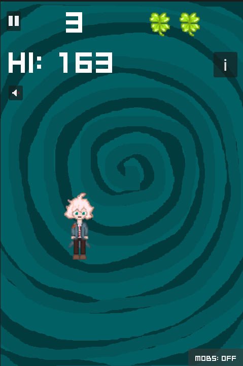
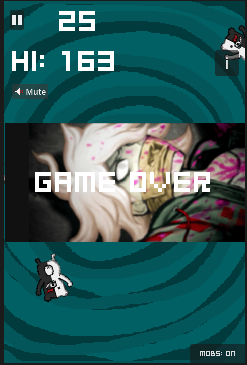

# Dodge-Em-Komaeda
Tweaked version of Godot's 2D Game tutorial with additional features and original pixel art.

# Godot 2D Game Tutorial:
[2D Game Tutorial](https://docs.godotengine.org/en/stable/getting_started/first_2d_game/)

# Additional features added:
> 3 Lives

> High Score tracking

> Pause function

> Custom Pixel Art (Original)

> Dodge Free Mode

# Controls
Move - Arrow Keys

Pause - Space

Credits - C key

# Gameplay

# Play
Out on [https://eggnstuff.itch.io/dodge-em-komaeda](https://eggnstuff.itch.io/dodge-em-komaeda)
